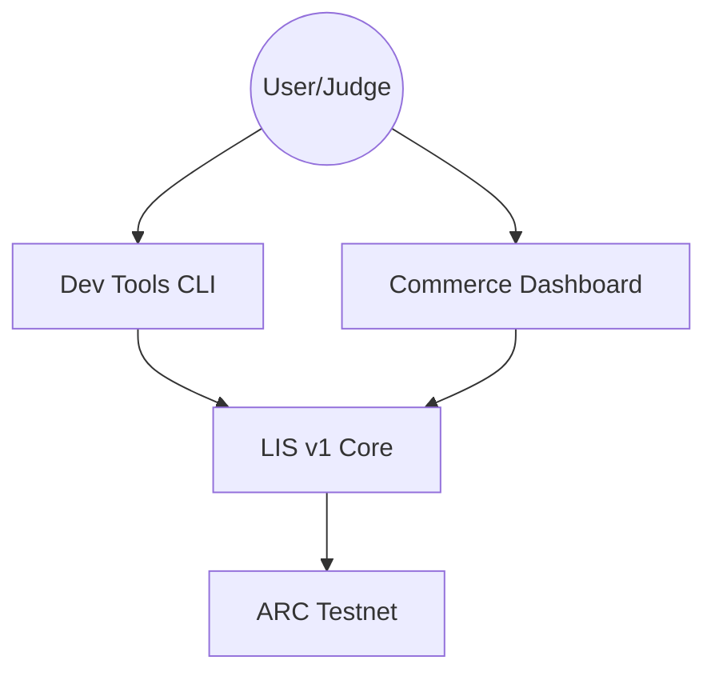

# Agentic Commerce Utils (ARC Hackathon SF)

> **Fiduciary Rails for the Autonomous Economy.**

This repository contains the **Liquidity Intents SDK (LIS) v1** and associated surfaces developed for the **ARC Hackathon SF**.
It demonstrates a complete end-to-end stack for distinct AI agents to discover each other, negotiate services, and settle payments autonomously on the **ARC Testnet**.

---

## 🏗️ Architecture

The project is organized into three distinct layers, each mapping to a hackathon track or core function:



### 1. [Core Infrastructure](/aiconomy-arc-hackathon-sf)
The **Brain**. A TypeScript SDK implementing the "Liquidity Intents" standard.
-   **Role**: Handles Fiduciary Policy, ERC-8004 Discovery, and x402 Micropayments.
-   **Chain**: ARC Testnet.

### 2. [Dev Tools CLI](/cli)
The **Hands**. A developer-facing command line tool.
-   **Track**: *Dev Tools*.
-   **Purpose**: Allows developers to "Go to Market" with an agent in < 5 minutes.
-   **Key Features**: Profile Init, Policy Config, One-Click Publishing.

### 3. [Autonomous Commerce App](/app)
The **Face**. A read-only observer dashboard.
-   **Track**: *Autonomous Commerce*.
-   **Purpose**: providing a "Mission Control" view for judges to verify agent autonomy.
-   **Key Features**: Real-time Treasury visualization, Activity Logs, Identity Verification.

---

## 🚀 Quick Start

### Prerequisites
-   Node.js 18+
-   npm

### 1. Setup
```bash
# Install dependencies for all workspaces
npm install
```

### 2. Run the CLI Tour
```bash
cd cli
npm install
npm run dev -- --help
```

### 3. Launch the Commerce Dashboard
```bash
cd app
npm install
npm run dev
# Open http://localhost:3000
```

---

## 🧪 Provenance Note

All work in this repository was authored during **ARC Hackathon SF**.
Intermediate commits were consolidated for clarity. The folder structure reflects the final submission state, separating Core logic from the UI/CLI surfaces.

**Legacy Artifacts**: Older v0 experiments have been moved to `archive/` to maintain a clean submission root.
