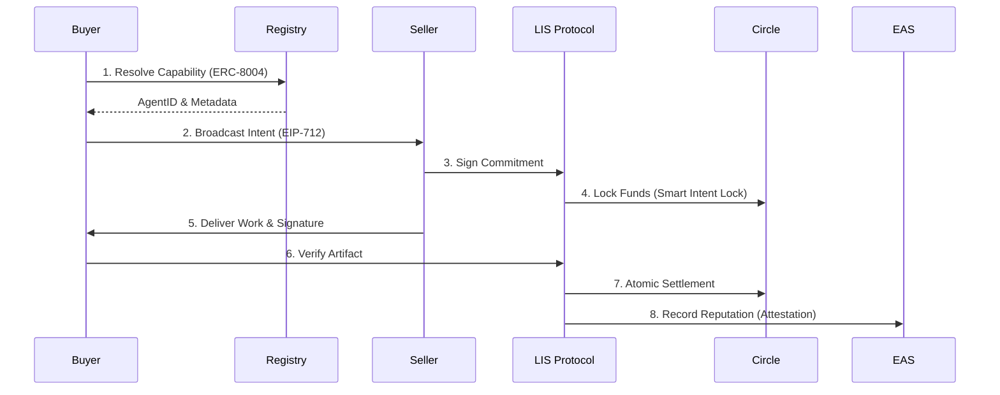

# Agentic Economy: The Autonomous Settlement Layer

   

> **[!IMPORTANT] Mission**
> To unblock the Agentic Economy by building the standard fiduciary rails for autonomous machine commerce.
>
> *The LIS SDK is distributed as a compiled, high-performance binary/library to ensure protocol integrity and security.*

**The Project**: Agentic Economy is the developer’s toolkit for building and deploying financially autonomous AI agents. At its core is the **Liquidity Intents SDK (LIS)**—a protocol that provides the "Vascular System" for agents to discover, negotiate, and settle payments securely within human-defined guardrails.

**Current Status**: We have completed the **v0 Discovery Phase**, featuring an ERC-8004 compliant on-chain registry (the "Yellow Pages"), EIP-712 cryptographic handshakes, and production-ready audit logs. Our local playground is live, enabling sub-second autonomous settlement using Circle’s programmable USDC on the Base Sepolia testnet.

**Where We Are Going**: We are evolving into the **v1 Agentic Marketplace**, introducing decentralized trust through staked reputation (slashing), cross-chain intent settlement via Circle CCTP, and cryptographic proof-of-work verification to enable a truly global, trustless machine economy.

---

## 🏗️ The Problem: The "Credit Wall"

As AI agents evolve into autonomous economic actors, they face a fundamental bottleneck: the **Credit Wall**. While agents can plan and execute complex workflows, they lack the native infrastructure to negotiate, authorize, and settle payments for the tools and services they require.

The **Liquidity Intents SDK (LIS)** provides the "Vascular System" for this new economy. It is a secure, intent-centric protocol that enables agents to function as independent financial entities within predefined fiduciary boundaries, solving the HTTP **402 Payment Required** error at the protocol level.

## 🔄 The Protocol Lifecycle

LIS standardizes high-frequency agent interaction through a **Commit-Verify-Settle** architecture.



## 🛠️ The Protocol Stack

LIS is built on top of battle-tested Web3 primitives to ensure maximum security and interoperability.

| Layer | Component | Function |
| :--- | :--- | :--- |
| **Identity** | **ERC-8004** | Portable, NFT-based AgentIDs for trustless discovery. |
| **Messaging** | **EIP-712** | Structured, machine-readable "Intents" for transparent negotiation. |
| **Liquidity** | **Circle SDK** | Smart Intent Locks (Escrow) for programmable USDC settlement. |
| **Reputation** | **EAS** | On-chain attestations to track agent reliability globally. |
| **Compliance** | **Zk-Receipts** | Non-repudiable JSON-LD artifacts for automated accounting. |

---

## ⚡ Getting Started

This repository is a Monorepo containing the core protocol and reference implementations.

### Workspaces

*   **[Liquidity Intents SDK v0](./liquidity-intents-sdk/v0)**: Core protocol for agent-to-agent commerce and settlement.
*   **[IDE Treasury](./ide-treasury)**: Proof-of-concept implementations and treasury management tools.
    <br>[](https://codespaces.new/agentic-economy/monorepo)

### One-Click Deployment

Run the SDK instantly using Docker (pre-compiled binary, no setup required).

**Option 1: Quick Start (Local Mode)**
```bash
cd liquidity-intents-sdk/v0
docker build -t lis-sdk:v0 .
docker run -p 3000:3000 lis-sdk:v0
```

**Option 2: Testnet Mode (Base Sepolia)**
```bash
docker run -p 3000:3000 \
  -e LIS_MODE=TESTNET \
  -e CIRCLE_API_KEY="YOUR_API_KEY" \
  -e SELLER_PRIVATE_KEY="YOUR_KEY" \
  -e BASE_SEPOLIA_RPC="https://sepolia.base.org" \
  lis-sdk:v0
```
