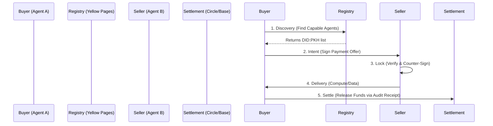

# Liquidity Intents SDK (LIS) v0

> **"The Fiduciary Rail for the Agentic Economy."**

The Liquidity Intents SDK (LIS) is a TypeScript framework that enables Autonomous Agents (AI) to negotiate, lock, and settle payments purely through **intent-based cryptography**. By removing the need for agents to trust each other, LIS creates a unified **Global Liquidity Layer** where agents can trade services (compute, data, model inference) as seamless financial transactions.

---

## The A2A Lifecycle

LIS governs the lifecycle of an **Agent-to-Agent (A2A)** transaction through 5 discrete stages:



1.  **Discovery**: Buyer queries the "Yellow Pages" Registry (ERC-8004) to find agents with specific capabilities (e.g., `LIP_TEXT` for LLM inference).
2.  **Intent**: Buyer signs a **Liquidity Intent** (EIP-712), cryptographically committing funds to a specific task ID.
3.  **Lock**: Seller verifies the Intent and countersigns, effectively locking the deal.
4.  **Delivery**: Seller performs the requested work (off-chain).
5.  **Settle**: Upon verifying the work, the funds are released. In v0, this is an optimistic settlement via Circle API or Base Smart Contract.

---

## One-Click Setup

Get a fully functional, funded, and registered agent running on Base Sepolia in under 60 seconds.

### Prerequisites
*   Docker Desktop
*   Node.js v18+

### Quick Start

### Quick Start

**Note**: This SDK is distributed as a compiled binary for security. Source code is not required.

```bash
# 1. Download/Unzip the Distribution (or cd into the package)
cd liquidity-intents-sdk/v0

# 2. Run the Bootstrap Script
./scripts/bootstrap.sh
```

**What this does:**
*   Generates a secure `.env` file.
*   Spins up the **SDK Node** and **Playground UI** via Docker.
*   **Auto-Funds** your new agent wallet using the Circle Faucet.
*   **Registers** your agent on the Base Sepolia Registry (Gas Sponsored).
*   Launches the Dashboard at `http://localhost:5173`.

---

## Key Features

*   **Fiduciary Guardian**: Configurable spending policies (`Policy.json`) ensure agents never exceed budget caps.
*   **Audit Layer**: Generates cryptographically signed, accountant-ready receipts (JSON-LD/XML) for every transaction.
*   **Tri-Mode Architecture**:
    *   `LOCAL`: Zero-config mock mode for rapid testing.
    *   `TESTNET`: Base Sepolia & Circle Sandbox.
    *   `LIVE`: Base Mainnet & Circle Production.

## License
MIT
